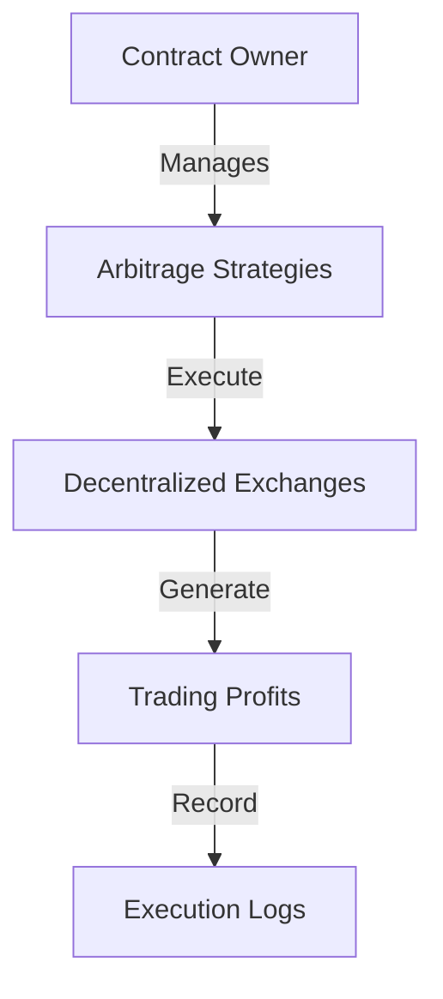

# Elastic Flashbot Optimizer

An advanced, permission-controlled arbitrage strategy management platform on the Stacks blockchain. The Elastic Flashbot Optimizer enables sophisticated traders and protocols to define, register, and execute on-chain arbitrage strategies with fine-grained control and transparent tracking.

## Overview

Elastic Flashbot Optimizer provides a secure and flexible framework for:
- Registering custom arbitrage strategies
- Enforcing trade limits and authorization
- Tracking arbitrage execution performance
- Maintaining a transparent, immutable record of trading activities

### Key Features
- Multi-level strategy authorization
- Configurable trade amount limits
- Detailed execution tracking
- Governance-based strategy management
- On-chain profit calculation

## Architecture



### Core Components
1. **Governance System**: Contract owner manages strategy registration
2. **Strategy Registry**: Tracks authorized arbitrage strategies
3. **Execution Tracking**: Records detailed trade performance
4. **Trade Validation**: Enforces strategy-specific trade limits

## Getting Started

### Prerequisites
- Clarinet
- Stacks wallet
- Test STX tokens (for testnet)

### Basic Usage

1. **Register a Strategy**
```clarity
(contract-call? .elastic-arbitrage register-arbitrage-strategy 
    'strategy-principal 
    u10000 ; max trade amount
)
```

2. **Execute Arbitrage**
```clarity
(contract-call? .elastic-arbitrage execute-arbitrage
    u5000 ; input amount
    u5250 ; minimum expected output
)
```

3. **Disable Strategy**
```clarity
(contract-call? .elastic-arbitrage disable-strategy 'strategy-principal)
```

## Function Reference

### Administrative Functions
- `transfer-ownership(new-owner)`
- `register-arbitrage-strategy(strategy, max-trade-amount)`
- `disable-strategy(strategy)`

### Trading Functions
- `execute-arbitrage(input-amount, min-output-amount)`

## Development

### Testing
Run the test suite using Clarinet:
```bash
clarinet test
```

### Local Development
1. Clone the repository
2. Install dependencies with `clarinet requirements`
3. Start local development chain with `clarinet start`

## Security Considerations

### Key Safeguards
- Strict strategy authorization
- Trade amount limits
- Transparent execution tracking
- Owner-controlled strategy management

### Limitations
- Requires manual strategy registration
- Relies on off-chain arbitrage opportunity detection
- Initial implementation with simplified profit calculation

## Disclaimer
Use at your own risk. Always conduct thorough testing and understand the potential financial implications of arbitrage strategies.